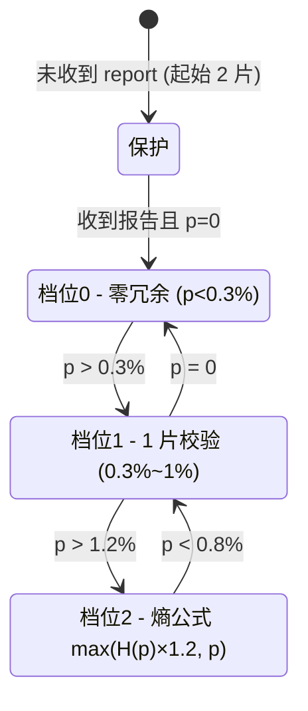
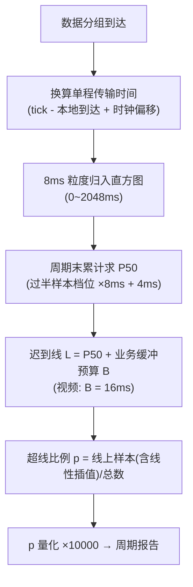
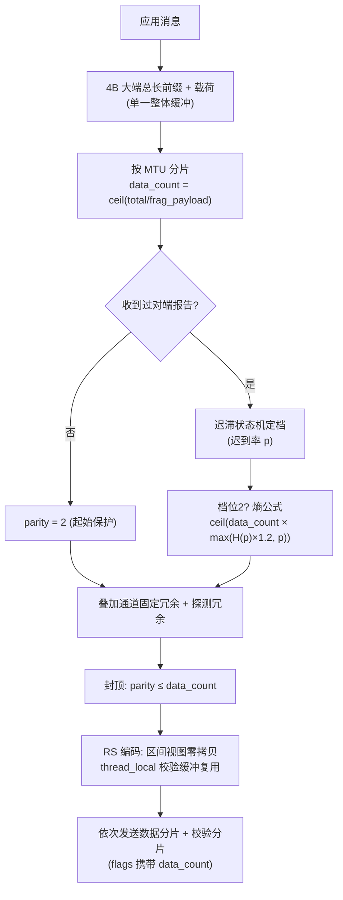
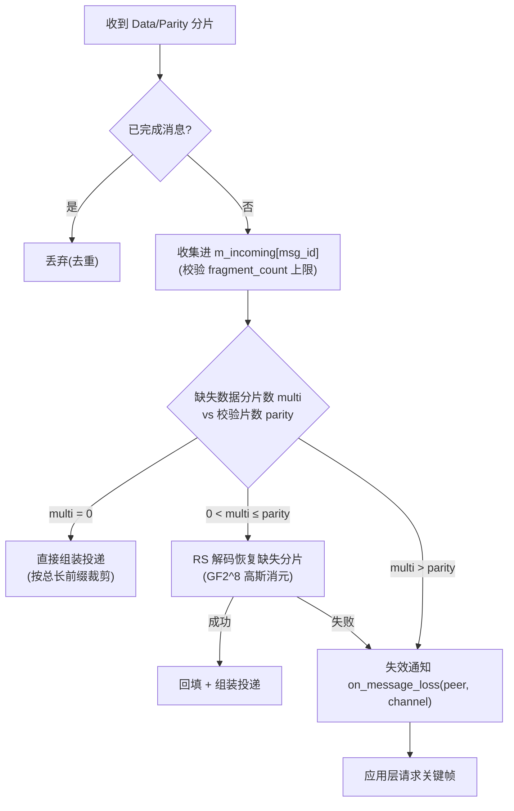
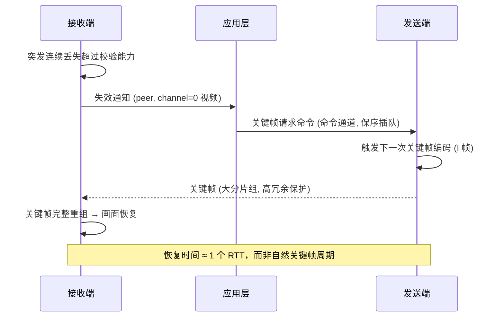

# 发明专利申请书（初稿）

**发明名称**：一种基于动态迟到线的自适应前向纠错编码方法、装置及系统

> 本文基于 creek/tight 传输库中 FEC 模块的实际实现撰写（`src/fragmenter.cpp`、`src/reassembler.cpp`、`src/report.cpp`、`src/bandwidth.cpp`、`src/fec.cpp`），用于专利申请评审与交底，具体法律措辞以代理机构正式稿为准。

---

## 一、发明名称

一种基于动态迟到线的自适应前向纠错编码方法、装置及系统

## 二、技术领域

本发明涉及实时网络传输技术领域，尤其涉及一种用于实时音视频等对延迟敏感业务的自适应前向纠错（Forward Error Correction，FEC）编码方法、装置及系统。

## 三、背景技术

在基于 UDP 的实时音视频传输（如视频通话、云游戏、远程控制、IoT 音视频回传）中，网络丢包和延迟抖动是影响体验质量（QoE）的主要因素。前向纠错（FEC）通过在数据分组之外附加冗余校验分组，使接收端能够在丢失部分数据分组时在线恢复数据，无需等待重传，因而被广泛用于低延迟场景。

现有 FEC 方案存在以下问题：

**1. 冗余量固定或仅按丢包率驱动，无法同时适应"延迟长尾"与"随机丢包"两类损伤。** 固定冗余在良好网络下浪费带宽，在恶劣网络下保护不足；仅按丢包率（loss rate）驱动的方案忽略了实时业务中"延迟超时即视为丢包"的语义——许多报文并未丢失，而是延迟超过了业务的播放期限（playback deadline），对接收端而言其效果等同丢包。此类报文不计入传统丢包统计，导致冗余配置偏低，画面持续卡顿。

**2. 冗余配置缺乏与网络延迟曲线的联动。** 实时业务对单程延迟分布（尤其是长尾）敏感：延迟中位数（P50）低但偶发长尾高时，需要覆盖长尾的冗余；延迟整体抬升时，需要整体提高冗余。现有方案普遍采用固定阈值（如固定倍数 RTT 或固定毫秒数）判定"迟到"，无法随网络实际延迟分布自适应调整判定标准，导致 FEC 冗余与业务缓冲预算不匹配。

**3. 熵公式驱动的冗余在高丢包/高迟到率区间失效。** 信息熵 H(p) 在概率 p=0.5 时达到峰值 1，当 p 趋近 1 时熵趋近 0。若直接以 H(p) 作为冗余系数，当链路严重劣化（p 很高）时冗余反而骤降，与保护需求恰好相反。

**4. 冗余档位切换振荡。** 网络状态在阈值附近波动时，冗余档位频繁切换（冗余加/减交替），造成带宽浪费或保护窗口抖动，且没有对链路建连初期（统计信息尚未建立）的保护机制。

**5. 缺乏失效反馈闭环。** 当 FEC 无法恢复消息时（如突发连续丢失超过校验能力），接收端无法告知应用层哪条流受损，应用层无法采取快速恢复措施（如视频关键帧请求），恢复时间完全取决于自然视频帧周期。

**6. 冗余控制与拥塞控制相互独立甚至冲突。** FEC 冗余占用带宽，若与拥塞控制的带宽估计不联动（冗余突发占用链路、或拥塞估计将冗余误判为数据），会相互干扰导致链路利用率下降或排队延迟飙升。

因此，亟需一种能够感知延迟长尾、自适应冗余配置、具备失效反馈闭环、并与拥塞控制联动的 FEC 方案。

## 四、发明内容

### （一）要解决的技术问题

针对现有技术的上述不足，本发明要解决的技术问题是：如何根据实时网络延迟分布（尤其是长尾特征）动态确定 FEC 冗余量，使其既能覆盖"延迟超时即视为丢包"的长尾报文，又不过度占用带宽；同时建立冗余档位的稳定切换机制、链路失效的快速反馈闭环，以及与拥塞控制的联动机制，从而在有限冗余开销下最大化实时传输的可达质量。

### （二）技术方案

#### 1. 总体架构

如图 1 所示，本发明由发送端、接收端与反馈链路构成闭环系统：

- **接收端**：对每个到达的数据分组测量其单程传输时间（利用发送端时间戳与两端时钟对表偏移换算），维护延迟分布直方图；每统计周期计算动态迟到线与超线比例 p（迟到率），随周期报告反馈给发送端；对无法通过 FEC 恢复的消息触发失效通知。
- **发送端**：接收迟到率 p 后，经带迟滞的分段冗余状态机确定本次消息的校验分片数，叠加通道级冗余与探测冗余后，采用 Reed-Solomon（RS）擦除码生成校验分片并与数据分片一并发送；同时将迟到率作为拥塞控制的次级信号参与带宽估计。

#### 2. 动态迟到线

如图 3 所示，动态迟到线的计算步骤为：

1. 接收端以固定粒度（如 8ms）将单程传输时间归入直方图（覆盖 0~2048ms，含长尾与排队积压）；
2. 统计周期末，由直方图求累计超过半数样本的最小档位，估算本周期单程延迟中位数 P50（取档位中点，如 `档位×8ms+4ms`）；
3. 动态迟到线 L = P50 + B，其中 B 为业务缓冲预算（由上层业务按播放期限给出，如视频场景取帧周期的一半，16ms）；
4. 超线比例 p = 迟到线以上样本数（含落入迟到线所在档位的线性插值部分）/ 总样本数；
5. p 量化后（如 ×10000）写入周期报告反馈给发送端。

本方案区别于固定阈值（固定倍数 RTT 或固定毫秒数）：迟到线随网络延迟曲线的中位数自适应移动，使"迟到"的判定始终贴合"超出业务缓冲预算"的真实语义。

#### 3. 分段冗余状态机与熵公式

如图 2 所示，发送端按迟到率 p 维护三段式迟滞状态机：

| 档位 | 迟到率区间 | 校验分片数 |
| --- | --- | --- |
| 档位 0 | p 低于 0.3%（统计分辨率下限） | 0（零冗余） |
| 档位 1 | 0.3% ~ 1% | 1 片 |
| 档位 2 | 高于 1% | 熵公式计算 |

迟滞切换规则（防振荡）：

- 档位 0 → 1：p > 0.3%（迟滞阈值，即统计分辨率下限）；
- 档位 1 → 2：p > 1.2%（1%×1.2，进入熵公式的迟滞）；
- 档位 2 → 1：p < 0.8%（1%×0.8，退出熵公式的迟滞）；
- 档位 1 → 0：p = 0（无超线报文）。

档位 2 的熵公式为：

```
冗余率 r = max( H(p) × 1.2 , p )
校验片数 = ceil( data_count × r )，下限 1，上限 100（安全阀门）
其中 H(p) = -p·log2(p) - (1-p)·log2(1-p)
```

本发明对纯熵公式作出两处改进：**其一**，乘以安全系数 1.2 使冗余略高于理论下限（覆盖统计噪声）；**其二**，以 `max(H(p)×1.2, p)` 补偿高 p 区间——H(p) 在 p→1 时趋 0，直接采纳会导致链路严重劣化时冗余骤降，取 max 后冗余率在高 p 区间跟随 p 单调上升，保护强度与损伤程度始终正相关。

**起始保护**：链路建立初期（尚未收到对端周期报告，统计信息缺失）按 2 片固定冗余起步，保护初始关键帧与时钟同步前的无统计窗口。

#### 4. 通道级冗余叠加

数据分组头中携带逻辑通道号（0..7），各通道可独立配置固定额外冗余 `channel_fec_extra`；总校验片数 = 状态机自适应片数 + 通道固定片数 + 探测冗余片数，并以数据分片数为上限封顶（校验片数不超过数据分片数）。实时视频通道走纯 FEC（迟到即丢，无需重传），音频等小帧关键通道可单独加强冗余。

#### 5. 失效反馈闭环

接收端重组时，若缺失数据分片数大于可用校验分片数，RS 解码失败，消息不可恢复——此时携带该消息所属逻辑通道号触发失效通知（on_message_loss）；应用层据此向发送端发送关键帧请求命令（命令通道独立、保序、插队发送）；发送端收到请求后立即触发下一次关键帧编码，从而将画面恢复时间从"等待自然关键帧周期"缩短至"一个往返时间"。关键帧体积大、分片多，恰好落入起始保护（未收到报告前 2 片冗余）或自适应冗余的保护范围。

#### 6. 与拥塞控制的联动

- 迟到率 p 作为带宽估计器的**次级信号**：p 升高只允许带宽估计更保守（否决探测增益、强制排空），不允许更激进；
- 无 L4S/ECN 反馈时，带宽跟跌后启动 **FEC 2× 探测**：在限定期限（如 6s）内追加 2 片真实冗余校验分片，将链路线速顶至约 2 倍估计带宽，利用接收端实测投递率重新发现链路余量，纠正带宽估计器因窗口最大值滤波造成的低估；
- 编码侧带宽预算联动：文件/数据通道有在途负载时，视频通道码率减半让出带宽（本申请附图省略，属可选的从属实现）。

#### 7. 编码实现的零拷贝与缓冲复用

RS 编码采用 GF(2⁸) 域（本原多项式 0x11D）Vandermonde 系数矩阵：第 p 个校验分片对第 j 个数据分片的系数为 `(j+1)^p`（p=0 时退化为全体 XOR）。数据分片以零拷贝区间视图（Span：指针+长度）引用单一整体缓冲，不足宽度的尾部分片按零补齐；校验缓冲与区间数组用线程局部（thread_local）存储复用，热点路径摊销零堆分配。

### （三）有益效果

1. **以"迟到率"驱动冗余**：将"延迟超时即视为丢包"的实时业务语义纳入冗余决策，FEC 覆盖对象与业务体验直接对应，同等冗余下画面卡顿显著减少；
2. **迟到线随延迟曲线自适应**：P50 + 业务缓冲预算的动态判定，无需人工调参即可适配不同网络（低延迟专线/高抖动公网/IoT 弱网）；
3. **高 p 补偿**：熵公式取 `max(H(p)×1.2, p)`，链路严重劣化时冗余单调上升，克服纯熵公式高 p 区间失效；
4. **迟滞状态机**：冗余档位稳定，避免阈值附近振荡造成带宽浪费；起始保护覆盖建连初期统计盲区；
5. **失效反馈闭环**：重组失败立即通知应用层并联动关键帧请求，画面恢复时间从秒级（自然关键帧周期）缩短至毫秒级（一个 RTT）；
6. **拥塞联动**：迟到率参与带宽估计（次级保守信号）+ FEC 2× 探测重新发现链路余量，冗余与限速相互配合，链路利用率不因冗余浪费；
7. **实现高效**：零拷贝区间视图 + 线程局部缓冲复用，冗余开销（编码 CPU、堆分配）摊销至近零。

## 五、附图说明

- **图 1**：系统总体架构与闭环反馈示意（发送端、接收端、周期报告、失效通知、关键帧请求）。
- **图 2**：分段冗余状态机及其迟滞切换阈值示意。
- **图 3**：动态迟到线计算流程（延迟直方图 → P50 → 迟到线 → 超线比例 p）。
- **图 4**：发送端 FEC 编码流程图（消息分片 → 状态机定冗余 → 冗余叠加 → RS 编码 → 发送）。
- **图 5**：接收端重组与恢复流程图（分片收集 → 缺失统计 → RS 解码 → 投递 / 失效通知）。
- **图 6**：失效反馈闭环时序图（重组失败 → 失效通知 → 关键帧请求 → 关键帧重发）。

```mermaid
%% 图 1：系统总体架构与闭环反馈
flowchart LR
    subgraph TX["发送端"]
        T1["消息分片"]
        T2["分段冗余状态机<br/>(迟到率 p 驱动)"]
        T3["冗余叠加<br/>通道固定 + 探测"]
        T4["RS 编码 (GF2^8 Vandermonde)"]
        T5["带宽估计器<br/>(p 为次级信号)"]
    end
    subgraph RX["接收端"]
        R1["分片收集 + 迟到统计<br/>(单程延迟直方图)"]
        R2["P50 / 迟到线 / 超线比例 p"]
        R3["RS 解码恢复"]
        R4["投递 / 失效通知"]
    end
    T1 --> T2 --> T3 --> T4 -->|数据+校验分片| R1
    R1 --> R2
    R1 --> R3 --> R4
    R2 -->|周期报告: 迟到率 p| T2
    R2 -->|周期报告: p50/投递率| T5
    R4 -->|失效通知(通道号)| A[应用层]
    A -->|关键帧请求命令| T1
    T5 -. 探测冗余标志 .-> T3
```











## 六、具体实施方式

### 6.1 系统实施例

参照图 1，系统包括发送端与接收端（可互为对端）。发送端维护每对端独立的分段冗余状态机与带宽估计器；接收端维护每对端独立的延迟直方图、迟到线与失效通知回调。周期报告（默认 333ms 或 1s，可配置）自接收端发送至发送端，携带：ack 游标、迟到率（×10000 量化，2 字节）、丢失序号列表、测速带宽、实测投递率、P50（毫秒，2 字节）、CE 标记占比等字段。迟到率、投递率、P50 即本发明的反馈载体。

### 6.2 接收端迟到统计与迟到线实施例

参照图 3。单程传输时间由报文头 48 字节中的发送端时间戳（tick，毫秒）与本地到达时间换算，并叠加握手期标定、心跳期再同步的时钟偏移（offset = 远端时钟 - 本地时钟），公式：

```
单程传输时间 = (本地到达低32位 - tick) × 1000 + 时钟偏移(µs)
```

延迟以 8ms 粒度归入 256 档直方图（覆盖 0~2048ms，包含长尾与排队积压段），档位 255 汇总所有更高延迟。统计周期末：

```
P50 = 累计样本数过半的最小档位 b × 8000 + 4000 (µs)
迟到线 L = P50 + late_buffer_ms × 1000
超线比例 p = (Σ_{bin>L} hist[bin] + hist[L] 线性插值) / 总样本数
```

其中 `late_buffer_ms` 由上层业务按播放期限给出（视频 33ms 帧周期取 16ms）。周期结束清零直方图，迟到线保留用于下一周期内到达分片的迟到判定。若 `late_buffer_ms` 未配置，则回退到"固定倍数 RTT"模式（迟到线 = late_rtt_multiplier × 当前 RTT 估计）。

### 6.3 发送端冗余决策实施例

参照图 2、图 4。每周期收到报告后更新对端迟到率 p 与"已收到报告"标志。发送一条消息时：

1. 计算 data_count（含 4 字节总长前缀）；
2. 未收到过报告 → parity = 2（起始保护）；否则按状态机迟滞规则定档并计算 parity（档位 0→0，档位 1→1，档位 2→熵公式）；
3. 叠加通道固定冗余（channel_fec_extra[channel]）与探测冗余（FEC 2× 探测期 2 片）；
4. 封顶：parity ≤ data_count；
5. 以 Vandermonde 系数 `coef(p,j)=(j+1)^p` 在 GF(2⁸) 域对数据分片（区间视图，不足宽度的尾部按零）生成 parity 个校验分片；
6. 数据分片与校验分片按序经发送回调发出，flags 字段携带 data_count（供接收端区分数据/校验分片）、reserved 字段高 4 位携带通道号、低 12 位携带真实负载长度。

### 6.4 接收端重组与失效通知实施例

参照图 5。接收端按消息组 id 收集分片；缺失数据分片数 multi 与校验片数 parity 比较：

- multi = 0：直接按 4 字节总长前缀裁剪组装并投递；
- 0 < multi ≤ parity：以收到的任意 multi 个校验分片执行 RS 解码（GF(2⁸) 高斯消元，Vandermonde 方子矩阵恒可逆），恢复缺失分片后组装投递；
- multi > parity：解码必然失败，触发失效通知 on_message_loss(peer, channel)（携带该消息所属逻辑通道号），消息保留由连接级清理回收，避免恶意分片占用内存。

成功投递的消息 id 记录于已完成集合（按时间戳，超时回收），重复分片直接丢弃。

### 6.5 失效反馈闭环实施例

参照图 6。视频场景下，收到失效通知（channel=0）后应用层经命令通道（单报文、保序、插队）发送关键帧请求；发送端置位强制关键帧标志，下一次编码输出 I 帧。I 帧分片数多，在起始保护（建连初期 2 片）或自适应冗余覆盖下完整到达，画面快速恢复。

### 6.6 拥塞控制联动实施例

带宽估计器采用 BBR 风格：BtlBw = 5 窗口最大值滤波，RTprop = 最小 RTT，增益按时间片循环（8 个探测周期 ×1.25 + 8 个排空周期 ×0.75）。迟到率 p 作为次级信号：p 升高只允许否决探测、强制排空（保守），不允许更激进。无 L4S 反馈且带宽刚经历跟跌时，启动 FEC 2× 探测（限 6s）：追加 2 片真实冗余把线速顶至约 2×btl，利用接收端实测投递率重新发现链路余量后撤除。

### 6.7 装置与介质实施例

本发明还提供一种电子装置（发送端/接收端），包括存储器与处理器，存储器中存储计算机程序，处理器执行所述程序时实现上述方法。本发明还提供一种计算机可读存储介质，其上存储计算机程序，程序被处理器执行时实现上述方法。

## 七、权利要求书

**1. 一种自适应前向纠错编码方法，其特征在于，包括：**

接收端对数据分组测量单程传输时间，按统计周期维护延迟分布直方图，由所述直方图计算本周期单程延迟中位数 P50，并计算动态迟到线 L = P50 + B，其中 B 为业务缓冲预算；统计单程传输时间超过所述动态迟到线的报文占比作为迟到率 p，随周期报告反馈给发送端；

发送端根据所述迟到率 p，经带迟滞的分段冗余状态机确定消息的校验分片数：第一档位为零冗余，第二档位为固定单校验片，第三档位按信息熵公式计算校验片数，档位间切换设置迟滞阈值；以所述校验片数对消息分片执行 Reed-Solomon 擦除码编码，生成校验分片与数据分片一并发送。

**2. 根据权利要求 1 所述的方法，其特征在于，所述信息熵公式为：校验片数 = ceil( data_count × max( H(p)×1.2 , p ) )，其中 H(p) = -p·log₂p - (1-p)·log₂(1-p)，data_count 为数据分片数；在 p 趋近 1 时冗余率跟随 p 单调上升。

**3. 根据权利要求 1 所述的方法，其特征在于，所述迟滞阈值为：第一档位切换至第二档位需 p 大于第一阈值；第二档位切换至第三档位需 p 大于第一阈值的 1.2 倍；第三档位退回第二档位需 p 小于第一阈值的 0.8 倍；第二档位退回第一档位需 p 等于零。

**4. 根据权利要求 1 所述的方法，其特征在于，链路建立初期未收到对端周期报告时，按固定数量的起始冗余片起步，所述固定数量为 2。

**5. 根据权利要求 1 所述的方法，其特征在于，数据分组携带逻辑通道号；所述校验分片数在状态机结果之上叠加通道固定冗余与带宽探测冗余，并以数据分片数为上限封顶。

**6. 根据权利要求 1 所述的方法，其特征在于，所述动态迟到线中，单程传输时间由分组携带的发送端时间戳、本地到达时间与时钟偏移换算，所述时钟偏移在握手期标定并在心跳期再同步；直方图以固定粒度分档，P50 取累计样本数过半档位的中点，超线比例对迟到线所在档位做线性插值。

**7. 根据权利要求 1 所述的方法，其特征在于，接收端对消息分片重组时，缺失数据分片数大于可用校验分片数时触发携带逻辑通道号的失效通知；应用层经命令通道向发送端发送关键帧请求，发送端据此触发下一次关键帧编码。

**8. 根据权利要求 1 所述的方法，其特征在于，发送端带宽估计器以所述迟到率作为次级信号，迟到率升高时仅允许带宽估计更保守；无显式拥塞反馈且带宽估计经历下跌时，在限定期限内追加探测冗余将链路线速提升至约 2 倍估计带宽，以接收端实测投递率重新发现链路余量。

**9. 一种自适应前向纠错编码装置，其特征在于，包括接收端模块与发送端模块：**

所述接收端模块包括：延迟统计单元，用于对数据分组测量单程传输时间并维护延迟分布直方图；迟到线计算单元，用于由所述直方图计算单程延迟中位数 P50 并计算动态迟到线 L = P50 + B；迟到率统计单元，用于统计单程传输时间超过所述动态迟到线的报文占比作为迟到率 p 并随周期报告反馈；失效通知单元，用于重组失败时触发携带逻辑通道号的失效通知；

所述发送端模块包括：冗余决策单元，用于根据所述迟到率 p 经带迟滞的分段冗余状态机确定校验分片数，第三档位按信息熵公式计算；FEC 编码单元，用于以所述校验分片数对消息分片执行 Reed-Solomon 擦除码编码并发送；关键帧响应单元，用于响应关键帧请求触发下一次关键帧编码。

**10. 一种计算机可读存储介质，其上存储有计算机程序，其特征在于，所述程序被处理器执行时实现权利要求 1 至 8 任一项所述的自适应前向纠错编码方法。**

---

## 八、附图清单

| 图号 | 内容 | 对应实现 |
| --- | --- | --- |
| 图 1 | 系统总体架构与闭环反馈 | `transport.cpp`、`report.cpp` |
| 图 2 | 分段冗余状态机与迟滞切换 | `fragmenter.cpp`（fragment_and_send 状态机） |
| 图 3 | 动态迟到线计算流程 | `reassembler.cpp`（迟到统计）、`report.cpp`（P50/超线比例） |
| 图 4 | 发送端 FEC 编码流程 | `fragmenter.cpp`、`fec.cpp` |
| 图 5 | 接收端重组与恢复流程 | `reassembler.cpp`（try_assemble） |
| 图 6 | 失效反馈闭环时序 | `reassembler.cpp` + `tight.hpp`（on_message_loss）+ 命令通道 |

## 九、现有技术对比表

| 对比项 | 现有技术 | 本发明 |
| --- | --- | --- |
| 冗余驱动信号 | 丢包率 / 固定冗余 | **迟到率**（延迟超时即视为丢的实时语义） |
| 迟到判定 | 固定倍数 RTT / 固定毫秒 | **动态迟到线 P50 + 业务缓冲预算**（随延迟曲线自适应） |
| 高 p 区间冗余 | 纯熵公式在 p→1 时冗余崩溃 | **max(H(p)×1.2, p)** 冗余单调上升 |
| 档位切换 | 无 / 单阈值 | **三档迟滞状态机**（±20% 迟滞防振荡）+ 起始 2 片保护 |
| 失效恢复 | 无反馈，等自然关键帧 | **失效通知 + 命令通道关键帧请求**（恢复 ≈ 1 RTT） |
| 拥塞联动 | 相互独立 | 迟到率作次级保守信号 + **FEC 2× 探测**重测链路余量 |
| 实现开销 | 每消息堆分配 | 零拷贝区间视图 + 线程局部缓冲复用 |

---

## 十、新颖性初步检索报告

> 检索日期：2026-08-18。检索范围：Crossref 论文库（DOI 系统）、DuckDuckGo / Bing 网页精确短语检索、arXiv API。**未覆盖**：中国国家知识产权局（CNIPA）专利库、EPO / USPTO 全文库、Google Patents 检索（页面为 JS 渲染，工具无法解析）——正式查新必须由代理机构在上述官方库补检。

### 10.1 检索到的相关现有技术

| # | 文献 / 标准 | 年份 | 相关特征 | 与本发明差异 |
| --- | --- | --- | --- | --- |
| 1 | **SMPTE ST 2022-1**：Forward Error Correction for Real-Time Video/Audio Transport over IP Networks（含 2007 修订版） | 2007 | RTP 承载的实时音视频标准 FEC 格式 | 冗余为固定配置，无自适应驱动信号 |
| 2 | **RFC 5109 / RFC 6865**（RTP Generic FEC / Reed-Solomon FEC） | 2007/2013 | 标准 FEC 分组与 RS 编码（GF(2⁸)） | 编码机制相同，但冗余由应用固定配置，无迟到感知 |
| 3 | Podolsky、McCanne、Katz：*A Simulation Study of Adaptive FEC for Packet Audio* | 1998 | **按丢包率**自适应 FEC 冗余的经典研究 | 驱动信号为**丢包率**，非单程延迟超时（迟到率）；无动态迟到线 |
| 4 | Bolot 等：*Adaptive FEC-based error control for Internet telephony*（INFOCOM'99） | 1999 | 丢包率驱动的自适应 FEC 冗余选择 | 同上 |
| 5 | *Integrating packet FEC into adaptive voice playout buffer algorithms on the Internet*（INFOCOM 2000） | 2000 | FEC 与**自适应播放缓冲**（playout buffer）联合优化 | 自适应对象是**播放缓冲目标延迟**（buffer 侧），不是"延迟中位数+业务预算"构成 FEC 迟到判定线；冗余仍按丢包率 |
| 6 | *Adaptive forward error correction with adjustable-latency QoS for robotic networks*（ICRA 2016） | 2016 | **延迟**作为可调 QoS 约束参与自适应 FEC | 以**预算约束/分配**方式使用延迟（延时预算内选冗余），非"测量延迟分布→统计迟到率→闭环驱动冗余" |
| 7 | *QoS-based optimal adaptive playout-buffer scheduling using the packet arrival distribution*（MILCOM 2009）等 playout buffer 文献 | 2009 | 基于**到达分布/百分位**自适应播放缓冲（WebRTC NetEq 同类思想） | 百分位统计用于播放调度目标，未用于 FEC 冗余判定线 |
| 8 | 基于丢包率自适应 FEC 的一大批专利族（华为/腾讯/Cisco/Google 等在 CN/US 布局的"FEC 冗余动态调整"类专利） | 2010s | 按丢包率、RTT 等反馈动态调整 FEC 冗余 | 反馈信号均非"单程延迟超过动态迟到线的占比"；未见 P50+业务缓冲预算构成迟到线的公开 |

### 10.2 逐特征新颖性初判

| 特征 | 检索结论 | 初判 |
| --- | --- | --- |
| 以**丢包率**驱动 FEC 冗余 | 大量公开（#3、#4、#8） | **现有技术**（背景技术） |
| 以**迟到率**（单程延迟超过迟到线的报文占比）驱动 FEC 冗余 | 精确短语 "late packet ratio FEC" / "late rate adaptive FEC" 检索无直接命中；最接近的是 #6（延迟作 QoS 约束）与 #5（FEC+playout 联合） | **暂未检索到直接公开**，具潜在新颖性；但须提防"延迟感知 FEC"上位概念（#6）做组合对比 |
| **动态迟到线 = P50 + 业务缓冲预算**（而非固定倍数 RTT / 固定毫秒） | 百分位统计与自适应播放缓冲本身公知（#7）；但"延迟中位数+业务缓冲预算构成 FEC 迟到判定线并随周期刷新"的组合未检索到公开 | **暂未检索到直接公开**，具潜在新颖性 |
| 熵公式冗余 + 高 p 补偿 `max(H(p)×1.2, p)` | 信息熵驱动冗余是公知思想；高 p 区间 max 补偿未见检索到公开 | 具体公式具潜在新颖性（需以公式+效果限定权项） |
| 三档**迟滞状态机** + 起始保护冗余 | 迟滞切换在控制领域公知；用于 FEC 档位切换的迟滞未见直接公开 | 组合特征，可作从属权项支撑 |
| 重组失败→**失效通知（携带通道号）→ 关键帧请求命令**闭环 | 视频"关键帧请求/丢帧恢复"属应用层公知做法（如视频会议），但由传输层 FEC 失效驱动并携带通道号的上报未见直接公开 | 中风险：应用层部分可能被归为惯用手段，需限定"传输协议层失效事件驱动的请求" |
| FEC **2× 探测**与迟到率次级保守信号（拥塞联动） | BBR 风格拥塞控制公知；"追加 FEC 冗余把线速顶至 2×btl 重测链路余量"未检索到公开 | 具潜在新颖性 |

### 10.3 风险提示

1. **上位化风险**：若审查员以 #6（延迟约束自适应 FEC）+ 公知的百分位/播放缓冲手段组合，可能质疑权 1"迟到率驱动"的创造性。建议独立权利要求同时限定**三个联动特征**（迟到率统计 → 动态迟到线 → 三档迟滞状态机），用"整体技术效果"（无人工调参、冗余随延迟曲线自适应）论证非显而易见。
2. **术语风险**："迟到率 / 动态迟到线"非标准术语，与 playout buffer 文献中的 "late packet / late arrival"（指播放时已迟到的报文）可能产生概念混同。建议申请中明确定义："迟到率 = 单程传输时间超过 P50+业务缓冲预算的报文占比"，并强调本发明的迟到**判定线由接收端按延迟分布实时计算**，区别于 playout buffer 的"到达时已过播放时刻"判定。
3. **中文库缺口**：华为、腾讯、中兴等在 CN 库有大量 FEC 自适应专利（多为丢包率/RTT 驱动），CNIPA 深度检索前不能定稿。
4. **自有公开**：本库（creek/tight）为开源代码且文档公开于本仓库，若申请时该仓库已公开可见，其公开日即构成对权项的新颖性障碍（自我公开）。**申请日前应保持仓库私有或优先权日早于公开日**。

### 10.4 建议

- 权 1 限定：迟到率（定义式）+ 动态迟到线 + 迟滞状态机 + 熵公式补偿，四项联动；
- 权 2/6 保留"P50+业务缓冲预算"与"直方图/线性插值"实现细节作从属支撑；
- 正式查新提交代理机构：CNIPA + EPO + USPTO 全文库，检索式建议：`(FEC OR "forward error correction") AND (redundancy) AND (latency OR delay) AND (adaptive)`、`"playout buffer" FEC`、`迟到率 前向纠错 冗余`。

