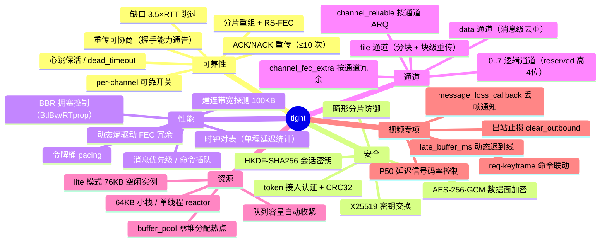
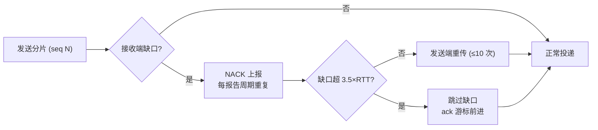
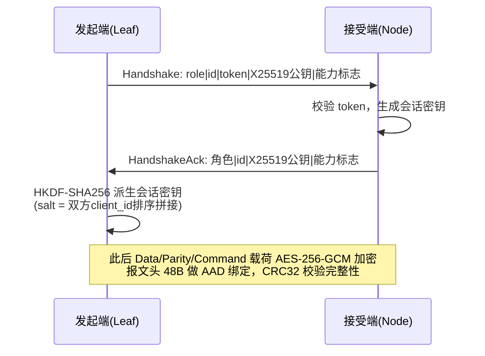
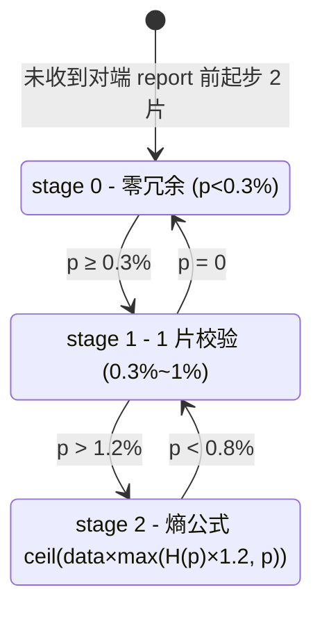
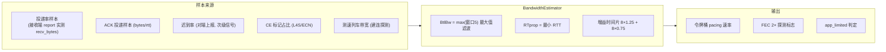
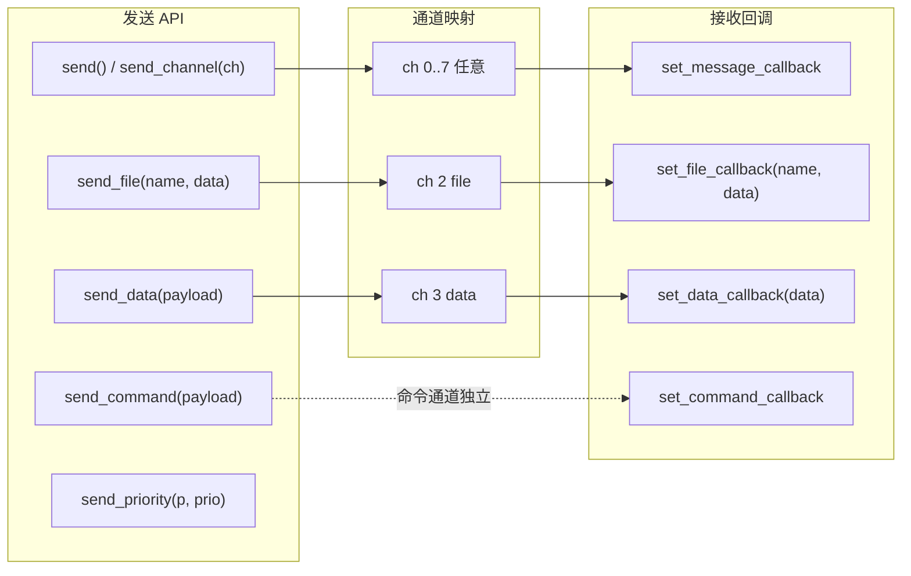

# tight — 功能总结

tight 是一个自包含、零第三方依赖的 C++17 **可靠 UDP 传输协议库**，面向端云实时通信场景（IoT 设备 ↔ 云端网关）：一端是资源充裕的多并发服务器（Node），另一端是 RAM/CPU/功耗受限的嵌入式设备（Leaf），同一份代码、两种运行模式覆盖两侧。

> 文档导航：本文件 = 功能总结；[architecture.md](architecture.md) = 架构；[design.md](design.md) = 设计要点；[usage.md](usage.md) = 完整使用文档；[litemode/](litemode/README.md) = lite 模式设计文档集。

## 1. 能力全景

## 2. 可靠性

| 机制 | 说明 |
| --- | --- |
| 分片 + FEC | 消息按 MTU 分片，Reed-Solomon（GF(2⁸)）校验片动态冗余，缺片可在线恢复 |
| NACK 重传 | 丢失序号每个报告周期重复上报（Report 丢失不致命）；缺口超 3.5×RTT 跳过（ack 游标不停滞），迟到重传照常投递 |
| 重传上限 | 每包最多重传 10 次，耗尽静默丢弃（文件传输由应用层块校验 + 补发兜底） |
| 保活与掉线 | 心跳（默认 5s）+ `dead_timeout`（默认 30s）掉线检测 + 自动重连；Online 通告按心跳周期幂等重发 |
| 重传协商 | `retransmit_enabled` 经握手能力标志通告，任一端可单方面关闭（纯 FEC 兜底），在途内存从 ∝码率降为常数 ~24KB |
| per-channel ARQ | `channel_reliable[8]` 按通道开关重传：可靠通道（file/data）参与缺口重传，不可靠通道（实时视频）缺口立即跳过 |

## 3. 安全

- 握手 X25519 密钥交换（RFC 7748），HKDF-SHA256 派生会话密钥；
- 数据面 AES-256-GCM 加密（`kFlagEncrypted` 标志），可配置开关 `encryption_enabled`；
- token 接入认证 + CRC32 完整性 + `max_message_bytes` 畸形分片防御（防内存耗尽）。

## 4. 性能

### 4.1 动态 FEC 冗余（分段状态机）

- 超线比例 p = 单程传输时间超过**迟到线**（`P50 + late_buffer_ms`，视频 16ms）的报文占比；
- 熵公式 H(p) 按迟到概率信息量驱动冗余率，带 ±20% 迟滞防振荡，100 片安全阀门；
- `channel_fec_extra[8]` 按通道叠加固定冗余（如音频通道单独加强）。

### 4.2 BBR 风格拥塞控制

关键规则：

- 投递率样本来自接收端实测（`m_recv_bytes`），不受 ACK 游标跳缺影响，是 BtlBw 的可靠测量源；
- app_limited 用**最近 500ms 发送活动**判定（队列空但应用在连续发送不算 app_limited），避免 btl 卡死；
- pacer_limited（令牌桶真卡住）的样本**拒绝采纳**（否则排空片会误读 ~0.6×BtlBw 导致坍缩）；
- 增益只由时间片决定（探测 1.25 / 排空 0.75 / 巡航 1.0），RTT 不参与（应用速率恒大于链路时纯 RTT 触发排空会永久停在 0.75）；
- L4S/ECN：CE 占比 >0 比例下降、=0 ×2 爬升；无 L4S 时用 FEC 2× 探测重新发现链路余量；
- 带宽变化 ≥100KB/s 且 >10%、间隔 ≥0.5s 才重置视频编码器参数。

## 5. 逻辑通道

通道号 0..7 写入数据报 `reserved` 高 4 位（`channel << 12 | real_size`），接收端据此识别：

| 通道 | 用途 | 可靠性 |
| --- | --- | --- |
| 0 | 默认（视频/数据） | 纯 FEC（视频场景），可 `channel_reliable[0]` 开启 |
| 1 | 常作音频通道 | `channel_fec_extra[1]` 单独加强冗余 |
| 2 | **file 通道**（`send_file`） | 可靠 ARQ（`channel_reliable[2]=true`）+ 块级重传 + 去重 |
| 3 | **data 通道**（`send_data`） | 可靠 ARQ（`channel_reliable[3]=true`）+ 消息级 only-once 去重 |
| 4..7 | 应用自定义 | 按需配置 |

file 消息格式（大端）：

| 消息 | tag | 载荷 |
| --- | --- | --- |
| manifest | `0x01` | `file_id(4) name_len(2) name total(8) chunk_size(4) chunk_count(4)` |
| chunk | `0x02` | `file_id(4) idx(4) data`（`kFileChunkSize=60KB`，chunk 消息 ≤64KB 上限） |
| data | `0x03` | `payload` |

接收端按 file_id 重组（`m_files`），块级去重（已收块直接忽略），全部到齐后在锁外拼装并经 `set_file_callback` 交付。

## 6. 视频场景专项接口

| 接口 | 作用 |
| --- | --- |
| `set_message_loss_callback(peer, channel)` | 重组失败（丢帧）通知 → 应用发 `req-keyframe` 命令快速恢复画面 |
| `late_buffer_ms` | 动态迟到线 = P50 + late_buffer_ms（视频 16ms），超线报文计入迟到率 p |
| `peer_p50_ms(peer)` | 对端上报的单程延迟中位数，P50>150ms 降 40%、>400ms 减半、>800ms 再降 1/3 |
| `outbound_queue_size()` | 出站积压数据报数（本地即时拥塞信号） |
| `clear_outbound()` | 丢帧止损：清空数据面积压（握手/报告/命令保留），配合 `force_keyframe` |
| `file_data_pending_bytes()` | file/data 待发负载，供带宽预算（有负载时视频让出一半 btl） |
| `estimated_bandwidth_bps()` / `btl_bw_bps()` | 拥塞控制观测（注意 `btl_bw_bps()` 返回 bytes/s） |

## 7. 资源与运行模式

| 模式 | 线程 | 空闲实例 | 传输在途增量 |
| --- | --- | --- | --- |
| 普通（服务器） | 4（reactor/receiver/encode/sender） | ~460KB | ≈ 码率 × 确认窗口 |
| lite（IoT 端侧） | 1（reactor 合并全部职责） | **~76KB** | 有重传 ∝码率；无重传常数 ~24KB |

lite 队列容量钳制：`queue_limit≤128` / `encode≤64` / `outbound≤256` / socket≤16KB；线程 64KB 小栈；`flush_interval` 自动钳制 ≥10ms。`set_lite_mode()` 运行时动态切换。

## 8. 关键配置摘要

| 配置 | 默认 | 说明 |
| --- | --- | --- |
| `mtu` | 1350 | 单包载荷 = mtu-48-16(GCM)=1286B，整包容纳 16kHz PCM 40ms 帧（1280B） |
| `max_message_bytes` | 64KB | 单消息上限，钳制 [8KB, 10MB] |
| `heartbeat` / `dead_timeout` | 5s / 30s | 保活与掉线检测 |
| `report_interval` | 1s（视频 333ms） | ACK/NACK + 迟到率 + 投递率上报周期 |
| `retransmit_enabled` | true | 数据面重传总开关（握手能力通告） |
| `encryption_enabled` | true | X25519 + AES-256-GCM |
| `speed_test_bytes` | 100KB | 建连带宽探测列车 |
| `initial_bandwidth_bytes` | 100MB | BBR 初始带宽（令牌桶种子，**仅作种子不作下限**） |
| `socket_buffer_bytes` | 8MB（lite ≤16KB） | 内核收发缓冲 |

## 9. 线格式摘要

- 报文头 **48B**：magic `0x54474854`、version 1、type（Handshake=0…Command=10）、flags（bit15=加密标志，低位=数据分片数 data_cnt）、client_id、session_id、sequence、acknowledgment、message_id、fragment_index/count、payload_size、reserved（高4位=通道号，低12位=real_size）、tick、CRC32；
- 握手载荷：`role | id_size | id | token | X25519 公钥(32B) | 能力标志(1B)`（bit0 = retransmit_enabled）；
- Report 载荷：ack 游标(4) | 迟到率×10000(2) | 丢失序号数(2) | reserved(4) | 丢失序号列表(4N) | 可选测速带宽(4) | 投递率(4) | p50_ms(2) | ce_ratio(2)。
