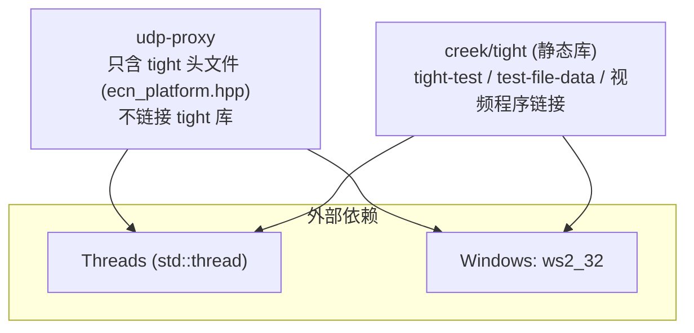
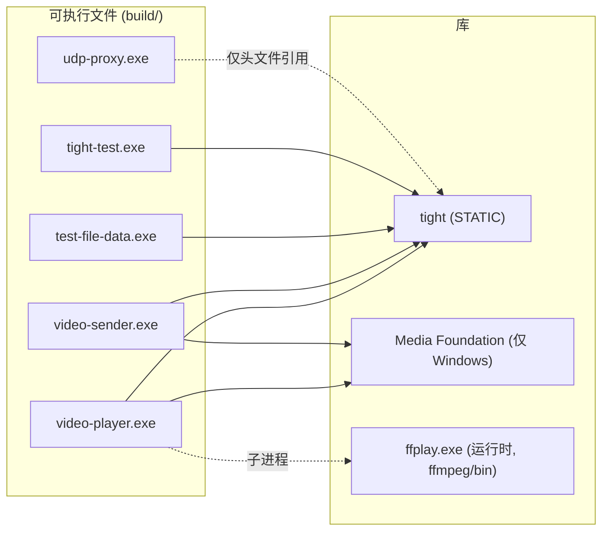

# udp-proxy 编译说明

## 1. 环境与依赖

- **CMake ≥ 3.14**，**C++17** 编译器
- Windows：MinGW-w64 gcc（本项目使用 gcc 15.2.0，**必须用 `-G "MinGW Makefiles"`**），需 `ws2_32`
- Linux / macOS：任意 C++17 编译器，需要 Threads（`find_package(Threads)`）

依赖关系：



> 注意：`udp-proxy` 仅通过 `target_include_directories(... creek/tight/src)` 引用 tight 的 `ecn_platform.hpp`（L4S CE 标记常量），**不链接** tight 库；`tight-test`、`test-file-data`、`video-sender`、`video-player` 才链接 `tight`。

## 2. 构建步骤

### 2.1 标准流程

```bash
# 1. 配置（Release，MinGW 生成器）
cmake -S . -B build -G "MinGW Makefiles" -DCMAKE_BUILD_TYPE=Release

# 2. 编译
cmake --build build -j 4

# 3. 产物
#    build/udp-proxy.exe
#    build/tight-test.exe
#    build/test-file-data.exe
#    Windows 另有: build/video-sender.exe, build/video-player.exe
```

### 2.2 完整重编译（含 tight 库）

```bash
# 重新配置（tight 的 CMakeLists 变更后建议）
cmake --build build --target clean
cmake -S . -B build -G "MinGW Makefiles" -DCMAKE_BUILD_TYPE=Release
cmake --build build -j 4
```

## 3. 目标清单

| 目标 | 源文件 | 链接 | 用途 |
| --- | --- | --- | --- |
| `udp-proxy` | `src/main.cpp` + `src/udp_proxy.cpp` | `ws2_32`、Threads | 弱网仿真代理 |
| `tight-test` | `src/tight_test.cpp` | `tight` | tight 协议端到端测试（node/leaf） |
| `test-file-data` | `src/test_file_data.cpp` | `tight` | file/data 通道测试 |
| `video-sender` | `src/video_sender.cpp` | `tight` + MF (`mfplat mfreadwrite mfuuid mf ole32 strmiids wmcodecdspuuid`) | Media Foundation 视频编码发送端（Windows） |
| `video-player` | `src/video_player.cpp` | `tight` + MF (`mfplat mfuuid mf wmcodecdspuuid winmm ole32`) | 视频接收播放端（Windows，ffplay 解码） |



## 4. 只构建某个目标

```bash
cmake --build build --target udp-proxy -j 4      # 仅代理
cmake --build build --target tight-test -j 4     # 仅 tight 测试
cmake --build build --target video-sender -j 4   # 仅视频发送端
```

## 5. 常见问题

| 问题 | 处理 |
| --- | --- |
| 生成器错误 `No CMAKE_CXX_COMPILER` | 确认 MinGW 在 PATH，或用 `cmake -G "MinGW Makefiles" -DCMAKE_CXX_COMPILER=g++` |
| 用 `-G "Visual Studio ..."` 报错 | 本项目按 MinGW 环境编写（Windows），统一用 `MinGW Makefiles` |
| 链接失败缺 `ws2_32` | 已在 CMakeLists 中处理（`target_link_libraries(udp-proxy ws2_32)`），勿手动移除 |
| 编译中断后增量构建 | `cmake --build build -j 4` 自动增量；改过 CMakeLists 后 cmake 自动重配 |
| 端口占用（如 5555/9999） | 先 `taskkill /f /im udp-proxy.exe`，再启动 |

## 6. 运行验证

```bash
# 快速自检：help
build\udp-proxy.exe --help

# 最小拓扑验证（3 个终端）
build\udp-proxy.exe --listen 0.0.0.0:5555 --target 127.0.0.1:9999 --bw 4000000 --stats-interval 1
# 另一终端
build\tight-test.exe node 9999 30
# 第三终端
build\tight-test.exe leaf 5555 30
```

统计输出应同时出现 forward / reverse 两行，`bw` 接近配置值，说明编译与运行正常。
