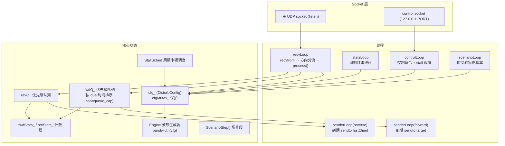
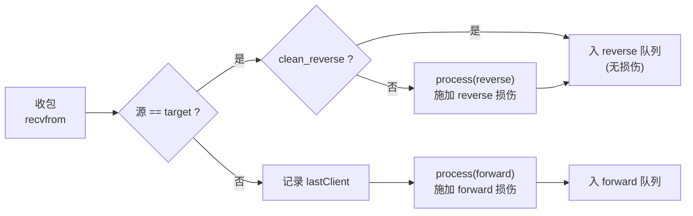
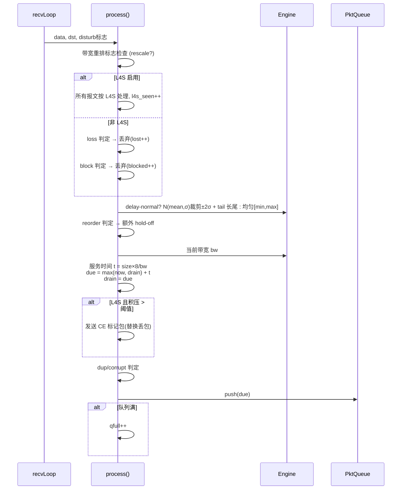
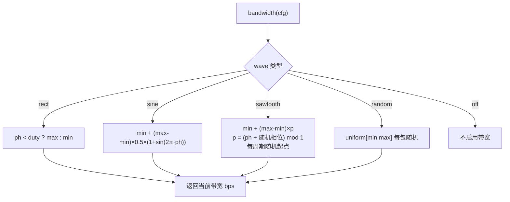
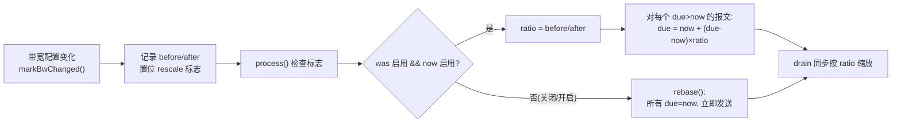
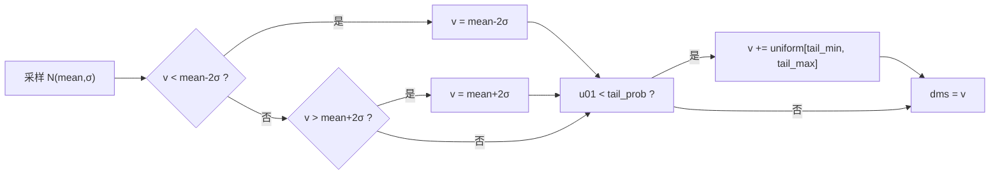
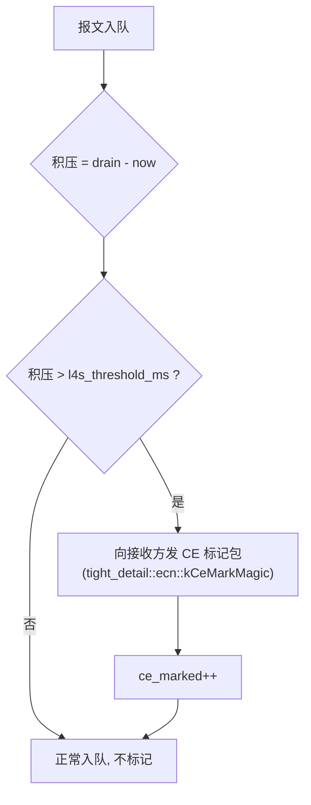
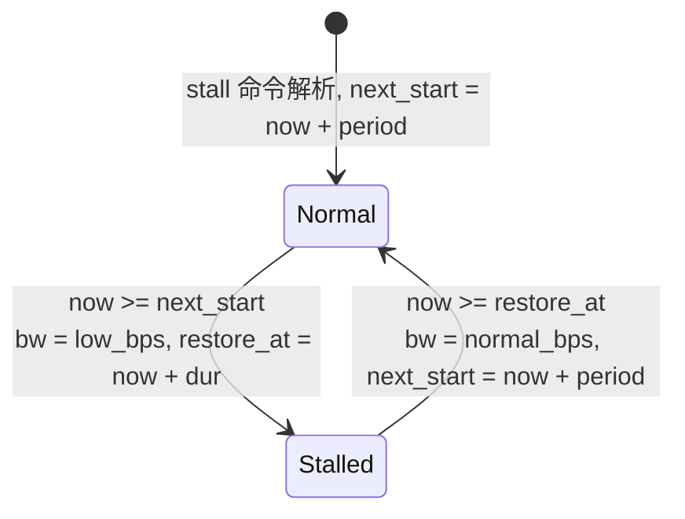
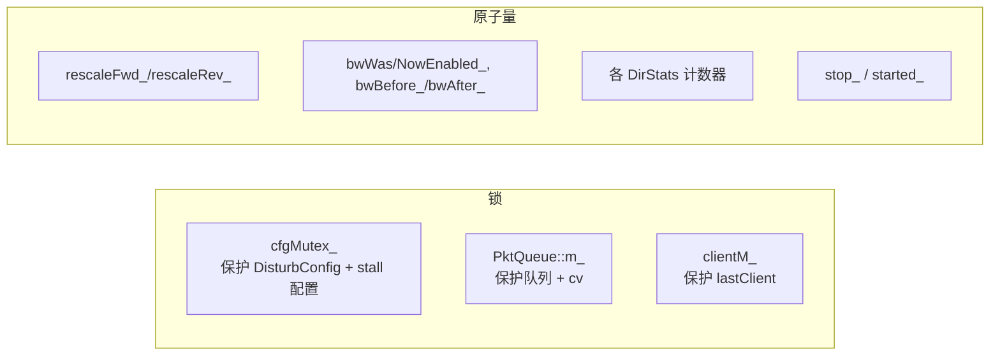

# udp-proxy 设计说明

UDP 弱网仿真代理的内部设计与实现机制，覆盖模块结构、报文处理管线、带宽调度、队列重排、L4S 仿真、周期卡顿与统计。

源码：`src/main.cpp`（入口 + 参数解析）、`src/udp_proxy.hpp`（`UdpProxy` / `DisturbConfig` / `PktQueue`）、`src/udp_proxy.cpp`（实现）。

---

## 1. 总体架构



线程分工：

| 线程 | 职责 |
| --- | --- |
| `recvLoop` | 唯一收包点。按源地址分流：target → reverse 队列；其他 → forward 队列并记录 `lastClient` |
| `senderLoop`（×2） | 阻塞在队列上，到报文 `due` 时间才 `sendto`（天然实现延迟 / 带宽调度 / 乱序） |
| `statsLoop` | 周期打印双向流量与损伤统计 |
| `controlLoop` | 读取控制命令并改配置；同时执行周期卡顿调度 |
| `scenarioLoop` | 按段应用场景脚本命令，段间休眠，循环回第一段时恢复启动参数 |

## 2. 报文处理管线

### 2.1 处理流程图



### 2.2 process() 单包损伤顺序



### 2.3 带宽限速模型（令牌桶等效）

`PktQueue` 是**按到期时间排序的优先级队列**，`drain` 记录"链路排队积压的虚拟完成时间"：

```
服务时间 tms = 报文大小(bytes) × 8 × 1000 / 当前带宽(bps)
due = max(当前时间, drain) + tms
drain = due
```

- 流量超过带宽 → `due` 不断后移 → 队列堆积（积压时延 = `drain - now`）；
- 队列满（`queue_cap`，默认 4096）→ 新报文丢弃（`qfull`），模拟拥塞丢弃；
- 带宽恢复 → 排队报文按新速率快速清空。

### 2.4 带宽波形（Engine::bandwidth）



其中 `ph = elapsed_ms mod period / period`。Sawtooth 的周期起点用 `splitmix64(cycle + seed)` 随机化，避免可预测的锯齿重复。

## 3. 带宽变化时的队列重排（rescale）

**问题**：带宽下降 → 旧积压按旧速率排程，链路被旧积压以旧速率长时间占用，带宽恢复后发送端测得的 btl（瓶颈带宽）长期不回升。

**机制**（`rescaleDirection` / `PktQueue::rescale`）：`controlLoop` 或场景切换导致带宽配置变化时，记录变化前后的有效速率，置位 `rescaleFwd_/rescaleRev_`；`process()` 下次收包时对队列内所有未到期报文按速率比压缩 `due`：



效果：带宽从 4M 降到 400K 时 `ratio=10`，旧积压的排程时间整体拉长 10 倍（等价于按新速率重新排程）；带宽恢复时 `ratio<1`，积压被压缩快速清空，btl 迅速回升。

## 4. 延迟模型

### 4.1 旧模式（uniform）

`delay-prob P` 概率命中后，在 `[delay-min, delay-max]` 均匀取延迟。

### 4.2 正态 + 长尾模式（delay-normal，推荐）

模拟真实网络的陡峭延迟曲线：

```
主体: N(mean, σ)，裁剪到 [mean-2σ, mean+2σ]
长尾: 另以 tail_prob 概率叠加 uniform[tail_min, tail_max] 的偶发大延迟
```



设计意图：主体延迟模拟常态排队抖动，长尾模拟偶发的拥塞/重传事件 —— 正是传输层 FEC 需要覆盖的报文。

## 5. L4S 仿真（RFC 9331）

Windows 上读取不到 IP TOS，因此当前实现**把入包一律视为 L4S 流**（单条 L4S 流的仿真场景）：



闭环：带宽下降 → 队列积压 → CE 标记 → 传输协议收到 CE 提前降速 → 队列清空 → 标记自动停止。标记替代丢包（`l4s` 启用时跳过 loss/block 丢弃），配合 tight 的 ECN 处理实现无丢包拥塞控制。L4S 模式下 `clean_reverse` 仅控制是否做延迟/带宽等扰动。

## 6. 周期卡顿调度（stall）

`controlLoop` 每次迭代调用 `applyStallSchedule()`，独立于带宽波形周期性制造"瞬间卡死"：

```
命令: stall <low_bps> <dur_ms> <period_ms>
行为: 每 period_ms 周期内, 前 dur_ms 带宽强制为 low_bps, 之后恢复 normal_bps
      (normal_bps = 卡顿前的 bw_max)
```



每次切换都会走 `markBwChanged` → 触发队列重排，保证卡顿开始/结束都立即反映到调度上。

## 7. 场景脚本执行器

```mermaid
sequenceDiagram
    participant M as main
    participant S as scenarioLoop
    participant C as apply_command
    participant P as process

    M->>S: set_scenario() 解析文件 → ScenarioStep[]
    loop 循环执行
        S->>S: idx==0 时 resetToBaseline()<br/>(恢复启动参数快照)
        S->>C: 逐条应用本段命令 (cmd1; cmd2; ...)
        S->>S: 分段休眠 100ms, 期间响应 stop / 控制命令
        S->>S: idx = (idx+1) % N, 时间到进入下一段
    end
    C->>P: 配置变更生效 (带宽变更会触发 rescale)
```

文件格式（`scenarios/*.txt`）：

```
<seconds> : cmd1 ; cmd2 ; ...
# 注释
```

- `#` 截断、首尾空白清除、空行跳过；
- 每段 `duration_s` 后进入下一段，**循环回第一段时恢复 baseline**（启动参数快照）；
- 段内命令语法与 `apply_command` 完全一致。

## 8. 并发与一致性



- `process()` 内先快照 `cfg_`（持锁拷贝），随后整个损伤计算不使用锁，避免长持锁；
- 带宽重排用原子标志"置位 + 消费"模式：`controlLoop` 置位，`process()` 下次收包消费执行，无需额外同步；
- 两个 `senderLoop` 在队列上 `cv_.wait_until(due)`，`stop()` 时 `wake()` 唤醒退出。

## 9. 统计口径

`statsLoop` 实测带宽 = `Δbytes × 8 / statsInterval`，与配置带宽（`bandwidth wave=...`）对照，可判断发送端是否充分利用链路。`qfull` 是拥塞的直接信号（发送速率 > 当前带宽），`ce` 是 L4S 标记计数。
