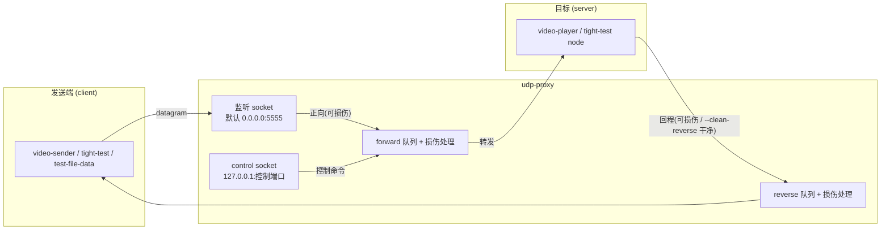
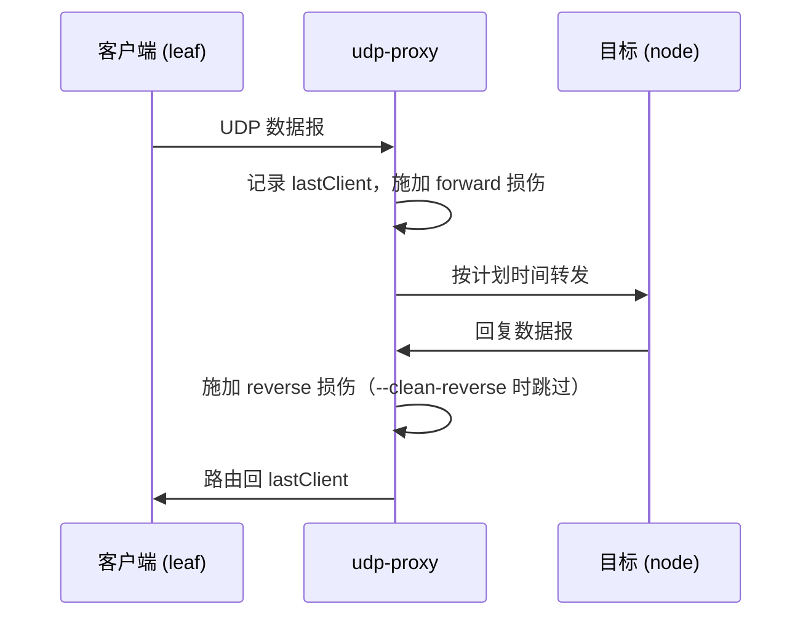
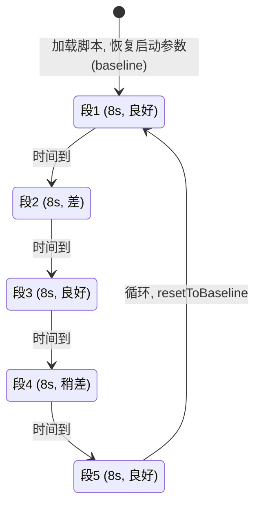

# udp-proxy 使用说明

UDP 弱网仿真代理：在本地 UDP 端口监听，把所有数据报转发给目标端口，并把回复按来源路由回去。转发与回程两个方向都可施加网络损伤（丢包 / 延迟 / 带宽限速 / 乱序 / 重复 / 损坏），用于测试 UDP 传输协议（如 creek/tight）在弱网下的表现。

## 目录

- [1. 拓扑与角色](#1-拓扑与角色)
- [2. 命令行参数](#2-命令行参数)
- [3. 运行示例](#3-运行示例)
- [4. 运行时控制命令](#4-运行时控制命令)
- [5. 场景脚本](#5-场景脚本)
- [6. 统计输出](#6-统计输出)
- [7. 配套测试脚本](#7-配套测试脚本)

---

## 1. 拓扑与角色



方向规则（`recvLoop` 中判断）：

- 源地址 == target 的报文走 **reverse** 队列，目的地址为最近一次客户端（lastClient）；
- 其余报文走 **forward** 队列，目的地址为 target，并记录来源为 lastClient。



---

## 2. 命令行参数

| 参数 | 说明 | 默认 |
| --- | --- | --- |
| `--target IP:PORT` | 目标（server）地址，**必填** | — |
| `--listen IP:PORT` | 监听地址 | `0.0.0.0:5555` |

### 丢包 / 阻塞

| 参数 | 说明 |
| --- | --- |
| `--loss 0~1` | 随机丢包率 |
| `--block 0~1` | 随机阻塞丢弃率（模拟拥塞丢弃，单独计数） |

### 延迟

| 参数 | 说明 |
| --- | --- |
| `--delay-prob P` | 报文被延迟的概率 |
| `--delay-min MS` | 随机延迟下限 |
| `--delay-max MS` | 随机延迟上限（在 [min,max] 内均匀分布） |

### 带宽限速 / 抖动

| 参数 | 说明 |
| --- | --- |
| `--bw BPS` | 固定带宽上限（无抖动） |
| `--bw-jitter-wave WAVE` | 抖动波形：`rect` / `sine` / `sawtooth` / `random` |
| `--bw-min BPS` | 带宽抖动下限 |
| `--bw-max BPS` | 带宽抖动上限 |
| `--bw-period MS` | 抖动周期（固定间隔） |
| `--bw-duty 0~1` | rect 波占空比 |

带宽调度：报文的发送时间 = `当前带宽 × 报文大小 × 8`。流量超过当前带宽时队列增长、报文被推迟发送；队列满时超出的报文被丢弃（计数为 `qfull`）。

### 乱序 / 其他损伤

| 参数 | 说明 |
| --- | --- |
| `--reorder-prob 0~1` | 报文被额外 hold-off 延迟的概率 |
| `--reorder-max MS` | hold-off 上限（使后发报文先到，产生乱序） |
| `--dup 0~1` | 重复率（同一报文发两份，间隔 50us） |
| `--corrupt 0~1` | 损坏率（随机翻转 1~3 个 bit，用于 CRC/AEAD 健壮性测试） |

### 其他

| 参数 | 说明 |
| --- | --- |
| `--seed N` | RNG 种子（可复现） |
| `--queue N` | 每方向队列容量（报文数） | 4096 |
| `--clean-reverse` | 回程（target→client）不施加损伤 |
| `--l4s` | 启用 L4S 仿真（RFC 9331） |
| `--l4s-threshold MS` | L4S 排队时延阈值（超过则发 CE 标记） |
| `--control PORT` | 控制端口（127.0.0.1），运行时重配置 |
| `--scenario FILE` | 加载损伤场景脚本（循环执行） |
| `--stats-interval S` | 统计打印间隔（秒），0=关闭 | 5 |
| `-h, --help` | 帮助 |

---

## 3. 运行示例

```bash
# 基本丢包
udp-proxy --target 192.168.1.10:9999 --loss 0.05

# 正弦带宽抖动 + 均匀延迟
udp-proxy --target 127.0.0.1:9999 --bw-jitter-wave sine \
    --bw-min 2000000 --bw-max 8000000 --bw-period 2000 \
    --delay-prob 0.1 --delay-min 100 --delay-max 300

# 固定带宽 + 丢包 + 阻塞 + 乱序
udp-proxy --target 127.0.0.1:9999 --bw 1000000 --loss 0.1 --block 0.1 \
    --reorder-prob 0.05 --reorder-max 200

# 视频弱网仿真（sender: 9999，proxy 转发到 9999，player 连 proxy）
udp-proxy --listen 0.0.0.0:5555 --target 127.0.0.1:9999 \
    --scenario scenarios/video_follow.txt --stats-interval 3
```

配合 tight 测试程序：

```bash
# 终端 1：目标（node）监听 9999
tight-test node 9999 60
# 终端 2：代理
udp-proxy --target 127.0.0.1:9999 --bw 4000000 --loss 0.02
# 终端 3：客户端（leaf）连代理 5555
tight-test leaf 5555 60 --msg-size 65536 --send-interval 100
```

---

## 4. 运行时控制命令

启动时加 `--control PORT`，即可向 `127.0.0.1:PORT` 发送 UDP 命令实时重配置（`controlLoop` 同时承担周期卡顿调度检查）：

```bash
# PowerShell 发送示例
$c = New-Object System.Net.Sockets.UdpClient
$b = [Text.Encoding]::UTF8.GetBytes("bw 400000")
$c.Send($b, $b.Length, "127.0.0.1", 6000)
```

| 命令 | 说明 |
| --- | --- |
| `bw <BPS>` | 固定带宽（>0 启用，=0 关闭） |
| `bw-min <BPS>` / `bw-max <BPS>` | 抖动上下限（启用带宽） |
| `bw-period <MS>` | 抖动周期 |
| `bw-duty <0~1>` | rect 波占空比 |
| `wave rect\|sine\|sawtooth\|random\|off` | 波形切换；`off` 关闭带宽 |
| `loss <R>` / `block <R>` / `dup <R>` / `corrupt <R>` | 各损伤率 |
| `delay-prob <P> [<min_ms> <max_ms>]` | 均匀延迟（兼容旧语法） |
| `delay-min <MS>` / `delay-max <MS>` | 延迟范围 |
| `delay-normal <mean_ms> <sigma_ms> [<tail_prob> <tail_min_ms> <tail_max_ms>]` | 正态延迟：主体 `N(mean,sigma)` 裁剪 ±2σ，另按 `tail_prob` 概率叠加 `[tail_min,tail_max]` 长尾（模拟偶发长尾报文，是 FEC 的覆盖目标） |
| `delay-off` | 关闭延迟 |
| `reorder-prob <R>` / `reorder-max <MS>` | 乱序 |
| `stats <S>` | 调整统计间隔 |
| `l4s on\|off` / `l4s-threshold <MS>` | L4S 开关与阈值 |
| `stall <low_bps> <dur_ms> <period_ms>` | 周期卡顿：每 `period_ms` 内 `dur_ms` 带宽降到 `low_bps`，其余恢复 `normal_bps`（卡顿前带宽）；`stall off` 取消 |
| `reset` | 清空全部损伤并关闭带宽 |

---

## 5. 场景脚本

`--scenario FILE` 加载时间轴脚本，每段结束后自动进入下一段，执行完**从头循环**（回到第一段时恢复启动参数）。

格式（每行一段，`#` 开头为注释）：

```
<持续秒数> : <命令1> ; <命令2> ; ...
```

命令语法与控制命令一致；**未指定的参数继承上一段**。示例 `scenarios/video_follow.txt`（40s 循环）：

```text
# 段1 良好(8s)：无延迟无丢包，10 Mbps
8: bw 10000000; loss 0; delay-off; reorder-prob 0

# 段2 差(8s)：均值 10ms σ1ms 延迟，2% 长尾 +50~200ms，2% 丢包
8: bw 2000000; loss 0.02; delay-normal 10 1 0.02 50 200

# 段3 良好(8s)：恢复
8: bw 10000000; loss 0; delay-off; reorder-prob 0

# 段4 稍差(8s)：1% 长尾 +50~150ms，1% 丢包
8: bw 4000000; loss 0.01; delay-normal 10 1 0.01 50 150

# 段5 良好(8s)：恢复
8: bw 10000000; loss 0; delay-off; reorder-prob 0
```

已有场景：

| 文件 | 说明 |
| --- | --- |
| `scenarios/video_follow.txt` | 40s 视频跟随性：良好→差→良好→稍差→良好 |
| `scenarios/video_weaknet.txt` | 120s 综合弱网：畅通→轻微→中度→重度（带长尾+乱序） |
| `scenarios/video_ramp.txt` | 80s 带宽阶梯：8M→3M→1.5M→6M，验证码率跟随 |



---

## 6. 统计输出

`statsLoop` 每 `--stats-interval` 秒打印一次双向统计：

```text
------------------------------------------------------------
  forward (client->target): recv=100 sent=95 bytes=123456 bw=4938240 bps | loss=3 block=0 qfull=0 delay=50 dup=0 corrupt=0 reorder=0 | l4s=0 ce=0
  reverse (target->client): recv=90 sent=90 bytes=... bw=... bps | ...
  bandwidth wave=rect range=[2000000, 4000000] bps period=2000ms duty=0.50
------------------------------------------------------------
```

字段含义：

| 字段 | 含义 |
| --- | --- |
| `recv` / `sent` | 本方向收到 / 转发的报文数 |
| `bytes` / `bw` | 转发字节累计 / 实测带宽（`Δbytes × 8 / 间隔`） |
| `loss` / `block` | 随机丢包 / 阻塞丢弃计数 |
| `qfull` | 队列满丢弃计数（带宽不足的信号） |
| `delay` / `dup` / `corrupt` / `reorder` | 各类损伤命中计数 |
| `l4s` / `ce` | L4S 报文数 / CE 标记发送数 |

---

## 7. 配套测试脚本

| 脚本 | 内容 |
| --- | --- |
| `run_video_follow.bat` | 视频跟随性：sender(9999) → proxy(5555→9999, `video_follow.txt`) → player(ffplay) |
| `run_video_direct.bat` | 直连：sender(9999) → player，无 proxy |
| `run_video_weaknet.bat` | 综合弱网 120s 场景 |
| `run_video_ramp.bat` | 带宽阶梯场景 |
